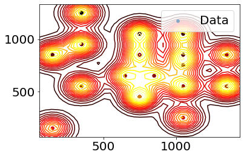

class: center 

```{r setup, include=FALSE}
options(htmltools.dir.version = FALSE)
```

# Groundwater emulation check-in

## New kanban board

[https://github.com/orgs/csiro-mlai/projects/3](https://github.com/orgs/csiro-mlai/projects/3)

---
class: center 

# Loss surface approximation

[GroundwaterEmulation/SurrogateOpt](https://github.com/csiro-mlai/GroundwaterEmulation/blob/master/SurrogateOpt.ipynb)

```{r out.width = "60%", echo=FALSE}
knitr::include_graphics("./media/objective_function_marginal.png")
```

---
class: center 

# Neural operator approximation

[GroundwaterEmulation/NN_Operator](https://github.com/csiro-mlai/GroundwaterEmulation/blob/master/NN_Operator.ipynb)

<video width="400" height="400">
<source src="./media/forward_sim.mp4" type="video/mp4" autoplay>
</video>

---
class: center 

# Structure-free model  (WIP)

```{r out.width = "60%", echo=FALSE}

```
[GroundwaterEmulation/StructureFreeModel](https://github.com/csiro-mlai/GroundwaterEmulation/blob/master/StructureFreeModel.ipynb)
---
# Random net/SDE/GP translation (WIP)

Translates between

* SDEs,
* covariance kernels, and 
* NNs.

$$\begin{aligned}
    \hat{\kappa}(\mathbf{\hat{x}}_p, \mathbf{\hat{x}}_q) &= \mathbb{E}[\psi(\mathbf{W}^\top \mathbf{\hat{x}}_p) \psi(\mathbf{W}^\top \mathbf{\hat{x}}_q)] \\
    &= \Vert \mathbf{\hat{x}}_p \Vert \Vert \mathbf{\hat{x}}_q \Vert \mathbb{E}[\psi(\mathbf{W}^\top \mathbf{\hat{x}}_p/\Vert \mathbf{\hat{x}}_p \Vert ) \psi(\mathbf{W}^\top \mathbf{\hat{x}}_q/\Vert \mathbf{\hat{x}}_q \Vert )] \\
    &= \Vert \mathbf{\hat{x}}_p \Vert \Vert \mathbf{\hat{x}}_q \Vert \underbrace{\mathbb{E}[\psi(\mathbf{W}^\top \mathbf{x}_p ) \psi(\mathbf{W}^\top \mathbf{x}_q )]}_{\kappa(\mathbf{x}_p, \mathbf{x}_q)},
\end{aligned}$$
---
# Latent function priors (TBD)

Lévy subordinators

---
# Uncertainty quantification (TBD)

[Exploring in next week’s reading group](https://confluence.csiro.au/display/MLAIFSP/Reading+Group)


